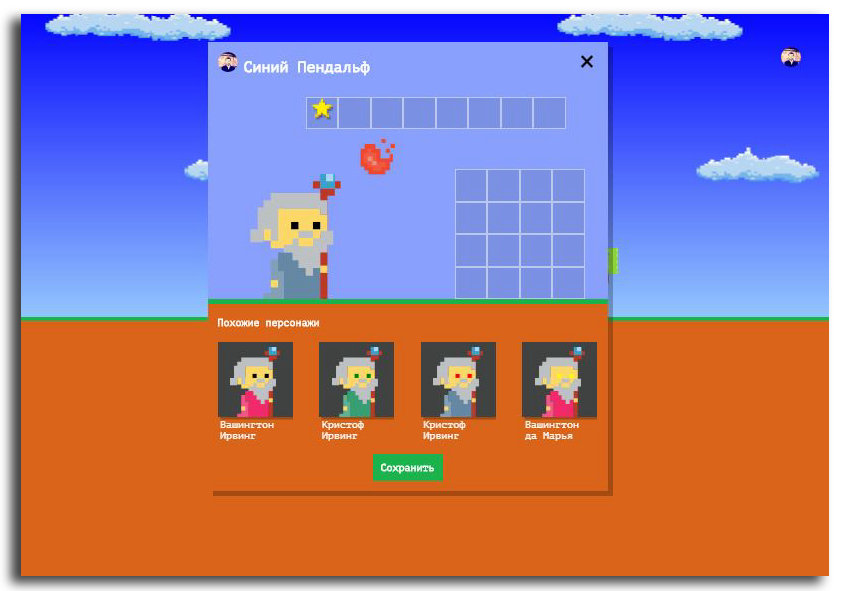

# Description:
Gandalf is a demo page of the platformer game “Code and Magic”, where you can play a game, 
and in a special window, adjust the appearance of the game character, buy artifacts for it that help in the game and look at similar characters from other players. [Demo](https://maksymchak.github.io/gandalf)

---
The repository is created for training in an intensive online course. «[Basic JavaScript](https://htmlacademy.ru/intensive/javascript)» from [HTML Academy](https://htmlacademy.ru).

Follow Me: [LinkedIn](https://www.linkedin.com/in/anton-maksymchak/), [Facebook](https://www.facebook.com/Anton.Maksymchak), [GitHub](https://github.com/maksymchak)

©[Anton Maksymchak](https://github.com/maksymchak) 2018

